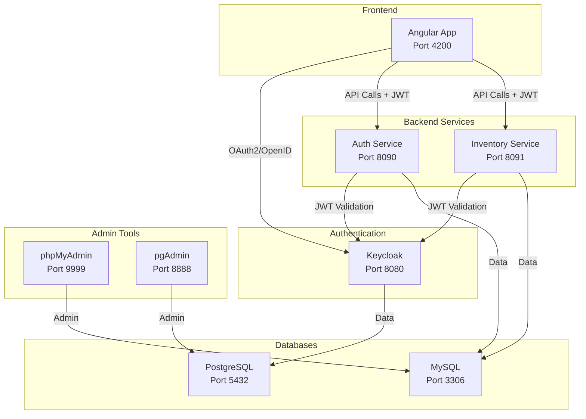

# 🔐 Spring Boot + Angular + Keycloak Security Platform

Une plateforme de sécurité moderne construite avec Spring Boot, Angular et Keycloak pour l'authentification et l'autorisation OAuth2/OpenID Connect.

## 📋 Table des matières

- [Vue d'ensemble](#-vue-densemble)
- [Architecture](#-architecture)
- [Technologies utilisées](#-technologies-utilisées)
- [Structure du projet](#-structure-du-projet)
- [Prérequis](#-prérequis)
- [Installation et configuration](#-installation-et-configuration)
- [Démarrage rapide](#-démarrage-rapide)
- [API Documentation](#-api-documentation)
- [Configuration](#-configuration)
- [Développement](#-développement)
- [Déploiement](#-déploiement)
- [Sécurité](#-sécurité)
- [Dépannage](#-dépannage)
- [Contribution](#-contribution)

## 🎯 Vue d'ensemble

Cette plateforme démontre une implémentation complète de sécurité moderne avec :

- **Authentification OAuth2/OpenID Connect** via Keycloak
- **Autorisation basée sur les rôles** (RBAC)
- **Interface utilisateur moderne** avec Angular 20
- **Services backend sécurisés** avec Spring Boot 3.5
- **Orchestration Docker** complète
- **Bases de données** MySQL et PostgreSQL

### Fonctionnalités principales

- ✅ Authentification SSO (Single Sign-On)
- ✅ Gestion des utilisateurs et rôles
- ✅ API sécurisées avec JWT
- ✅ Interface responsive et moderne
- ✅ Gestion d'inventaire avec autorisation
- ✅ Configuration par variables d'environnement
- ✅ Support Docker Compose

## 🏗️ Architecture



### Flux d'authentification

1. **Utilisateur accède à l'application** Angular (port 4200)
2. **Redirection vers Keycloak** pour l'authentification
3. **Keycloak valide** les identifiants et retourne un JWT
4. **Angular stocke le token** et l'inclut dans les requêtes API
5. **Services backend valident** le JWT avec Keycloak
6. **Accès autorisé** selon les rôles de l'utilisateur

## 🛠️ Technologies utilisées

### Backend
- **Spring Boot 3.5.5/3.5.6** - Framework principal
- **Java 21** - Langage de programmation
- **Spring Security 6** - Sécurité et OAuth2
- **Spring Data JPA** - Persistance des données
- **MySQL 8** - Base de données principale
- **Lombok** - Réduction du code boilerplate

### Frontend
- **Angular 20.2.0** - Framework frontend
- **TypeScript 5.9.2** - Langage de programmation
- **Bootstrap 5.3.8** - Framework CSS
- **Keycloak Angular** - Intégration OAuth2

### Infrastructure
- **Keycloak 23.0** - Serveur d'authentification
- **Docker & Docker Compose** - Conteneurisation
- **PostgreSQL 15** - Base de données Keycloak
- **Nginx** - Serveur web pour Angular

## 📁 Structure du projet

```
spring-keycloak-angular/
├── 📁 auth-service/                 # Service d'authentification
│   ├── src/main/java/com/anas/authservice/
│   │   ├── AuthServiceApplication.java
│   │   ├── config/                  # Configuration Spring Security
│   │   ├── controller/              # Contrôleurs REST
│   │   ├── entites/                 # Entités JPA (Person)
│   │   ├── repository/              # Repositories Spring Data
│   │   └── model/                   # Modèles de données
│   ├── src/main/resources/
│   │   ├── application.properties   # Configuration
│   │   └── templates/               # Templates Thymeleaf
│   └── Dockerfile
├── 📁 inventory-service/            # Service d'inventaire
│   ├── src/main/java/com/anas/inventoryservice/
│   │   ├── InventoryServiceApplication.java
│   │   ├── controllers/             # Contrôleurs REST
│   │   ├── entities/                # Entités JPA (Product)
│   │   ├── repository/              # Repositories Spring Data
│   │   └── sec/                     # Configuration sécurité
│   └── Dockerfile
├── 📁 front-end/                    # Application Angular
│   ├── src/app/
│   │   ├── app.config.ts           # Configuration Keycloak
│   │   ├── guards/                 # Guards d'authentification
│   │   ├── home/                   # Page d'accueil
│   │   ├── person/                 # Gestion des personnes
│   │   └── product/                # Gestion des produits
│   ├── package.json
│   └── Dockerfile
├── 📁 keycloak/                     # Configuration Keycloak
│   └── import/                      # Realms à importer
├── 📁 nginx/                        # Configuration Nginx
├── docker-compose.yml              # Orchestration Docker
├── .env.global                     # Variables d'environnement globales
└── README.md
```

## 📋 Prérequis

- **Docker & Docker Compose** (recommandé)
- **Java 21+** (pour développement local)
- **Maven 3.8+** (pour développement local)
- **Node.js 18+** (pour développement local)
- **npm/yarn** (pour développement local)

## 🚀 Installation et configuration

### 1. Cloner le projet

```bash
git clone <repository-url>
cd spring-keycloak-angular
```

### 2. Configuration des variables d'environnement

Créez les fichiers de configuration d'environnement :

```bash
# .env.global
KEYCLOAK_SERVER_URL=http://localhost:8080
KEYCLOAK_REALM=plateforme-realm
AUTH_SERVICE_PORT=8090
INVENTORY_SERVICE_PORT=8091
ANGULAR_PORT=4200

# .env.auth (dans auth-service/)
AUTH_SERVICE_CLIENT_ID=plateforme-client
AUTH_SERVICE_CLIENT_SECRET=your-keycloak-client-secret
AUTH_SERVICE_REDIRECT_URI=http://localhost:8090/login/oauth2/code/keycloak
AUTH_DB_URL=jdbc:mysql://mysql-db:3306/persons-db
AUTH_DB_USERNAME=anas
AUTH_DB_PASSWORD=root

# .env.inventory (dans inventory-service/)
SPRING_DATASOURCE_URL=jdbc:mysql://mysql-db:3306/inventory-db
SPRING_DATASOURCE_USERNAME=anas
SPRING_DATASOURCE_PASSWORD=root
SPRING_SECURITY_OAUTH2_RESOURCESERVER_JWT_ISSUER_URI=http://localhost:8080/realms/plateforme-realm
SPRING_SECURITY_OAUTH2_RESOURCESERVER_JWT_JWK_SET_URI=http://localhost:8080/realms/plateforme-realm/protocol/openid-connect/certs
```

## 🏃‍♂️ Démarrage rapide

### Option 1 : Docker Compose (Recommandé)

```bash
# Démarrer tous les services
docker-compose up -d

# Vérifier le statut
docker-compose ps

# Voir les logs
docker-compose logs -f
```

### Option 2 : Développement local

```bash
# Terminal 1 : Démarrer Keycloak
docker run -p 8080:8080 -e KEYCLOAK_ADMIN=admin -e KEYCLOAK_ADMIN_PASSWORD=admin quay.io/keycloak/keycloak:23.0 start-dev

# Terminal 2 : Démarrer MySQL
docker run -p 3306:3306 -e MYSQL_ROOT_PASSWORD=root -e MYSQL_DATABASE=persons-db mariadb:10.6

# Terminal 3 : Auth Service
cd auth-service
mvn spring-boot:run

# Terminal 4 : Inventory Service
cd inventory-service
mvn spring-boot:run

# Terminal 5 : Angular Frontend
cd front-end
npm install
npm start
```

## 🌐 Accès aux services

| Service | URL | Description |
|---------|-----|-------------|
| **Frontend Angular** | http://localhost:4200 | Interface utilisateur principale |
| **Auth Service** | http://localhost:8090 | Service d'authentification |
| **Inventory Service** | http://localhost:8091 | Service d'inventaire |
| **Keycloak Admin** | http://localhost:8080 | Console d'administration Keycloak |
| **phpMyAdmin** | http://localhost:9999 | Administration MySQL |
| **pgAdmin** | http://localhost:8888 | Administration PostgreSQL |

### Identifiants par défaut

- **Keycloak Admin** : `admin` / `admin`
- **MySQL** : `root` / `root`
- **PostgreSQL** : `keycloak` / `keycloak`

## 📚 API Documentation

### Auth Service (Port 8090)

#### Endpoints publics
- `GET /` - Page d'accueil
- `GET /login` - Page de connexion
- `GET /oauth2/authorization/keycloak` - Connexion Keycloak
- `GET /oauth2/authorization/google` - Connexion Google

#### Endpoints sécurisés
- `GET /persons` - Liste des personnes (authentifié)
- `GET /persons/{id}` - Détails d'une personne (authentifié)

### Inventory Service (Port 8091)

#### Endpoints sécurisés
- `GET /products` - Liste des produits (rôle ADMIN requis)
- `GET /products/{id}` - Détails d'un produit (rôle ADMIN requis)
- `POST /products` - Créer un produit (rôle ADMIN requis)
- `PUT /products/{id}` - Modifier un produit (rôle ADMIN requis)
- `DELETE /products/{id}` - Supprimer un produit (rôle ADMIN requis)

## ⚙️ Configuration

### Configuration Keycloak

1. **Accéder à la console Keycloak** : http://localhost:8080
2. **Se connecter** avec `admin`/`admin`
3. **Créer un realm** : `plateforme-realm`
4. **Créer les clients** :
   - `plateforme-client` (confidential) - pour les services backend
   - `angular-client` (public) - pour le frontend Angular
5. **Créer des utilisateurs** avec des rôles appropriés

### Configuration des rôles

- **ADMIN** : Accès complet à la gestion des produits
- **USER** : Accès en lecture seule
- **MANAGER** : Accès limité à certaines fonctionnalités

## 🔧 Développement

### Structure des entités

#### Person (Auth Service)
```java
@Entity
public class Person {
    @Id
    @GeneratedValue(strategy = GenerationType.IDENTITY)
    private Long id;
    private String name;
    private String email;
}
```

#### Product (Inventory Service)
```java
@Entity
public class Product {
    @Id
    private String id;
    private String name;
    private int quantity;
    private double price;
}
```

### Guards Angular

Le projet utilise des guards personnalisés pour l'autorisation :

```typescript
// Protection par rôle
{ 
  path: 'products', 
  component: Product, 
  canActivate: [canActivateAuthRole],
  data: { role: 'ADMIN' } 
}
```

### Configuration OAuth2

Le service d'authentification supporte :
- **Keycloak** (principal)
- **Google OAuth2** (optionnel)

## 🐳 Déploiement

### Production avec Docker

```bash
# Build des images
docker-compose build

# Démarrage en production
docker-compose -f docker-compose.yml -f docker-compose.prod.yml up -d
```

### Variables d'environnement de production

```bash
# Production
KEYCLOAK_SERVER_URL=https://your-keycloak-domain.com
KEYCLOAK_REALM=production-realm
AUTH_SERVICE_CLIENT_SECRET=your-production-secret
```

## 🔒 Sécurité

### Bonnes pratiques implémentées

- ✅ **JWT Token Validation** sur tous les endpoints sécurisés
- ✅ **CORS Configuration** appropriée
- ✅ **HTTPS Ready** pour la production
- ✅ **Environment Variables** pour les secrets
- ✅ **Role-Based Access Control** (RBAC)
- ✅ **OAuth2 Authorization Code Flow**
- ✅ **PKCE** pour les clients publics

### Configuration de sécurité

```properties
# JWT Resource Server
spring.security.oauth2.resourceserver.jwt.issuer-uri=${KEYCLOAK_SERVER_URL}/realms/plateforme-realm
spring.security.oauth2.resourceserver.jwt.jwk-set-uri=${KEYCLOAK_SERVER_URL}/realms/plateforme-realm/protocol/openid-connect/certs
```

## 🐛 Dépannage

### Problèmes courants

#### 1. Erreur de connexion Keycloak
```bash
# Vérifier que Keycloak est démarré
docker-compose logs keycloak

# Vérifier la configuration du realm
curl http://localhost:8080/realms/plateforme-realm/.well-known/openid_configuration
```

#### 2. Erreur CORS
```bash
# Vérifier la configuration CORS dans Keycloak
# Client Settings > Web Origins: http://localhost:4200
```

#### 3. Erreur de base de données
```bash
# Vérifier la connexion MySQL
docker-compose exec mysql-db mysql -u root -proot -e "SHOW DATABASES;"
```

#### 4. Token JWT invalide
```bash
# Vérifier la configuration JWT
curl -H "Authorization: Bearer YOUR_TOKEN" http://localhost:8091/products
```

### Logs utiles

```bash
# Logs de tous les services
docker-compose logs -f

# Logs d'un service spécifique
docker-compose logs -f auth-service
docker-compose logs -f inventory-service
docker-compose logs -f angular-app
```

## 🤝 Contribution

1. **Fork** le projet
2. **Créer** une branche feature (`git checkout -b feature/AmazingFeature`)
3. **Commit** vos changements (`git commit -m 'Add some AmazingFeature'`)
4. **Push** vers la branche (`git push origin feature/AmazingFeature`)
5. **Ouvrir** une Pull Request

### Standards de code

- **Java** : Suivre les conventions Spring Boot
- **TypeScript** : Utiliser ESLint et Prettier
- **Commits** : Format conventionnel (feat:, fix:, docs:, etc.)

## 📄 Licence

Ce projet est sous licence MIT. Voir le fichier `LICENSE` pour plus de détails.

## 👨‍💻 Auteur

**Anas Lahboub**
- GitHub: [@anaslahboub](https://github.com/anaslahboub)
- Email: anas.lahboub@edu.uiz.ac.ma

## 🙏 Remerciements

- [Spring Boot](https://spring.io/projects/spring-boot) - Framework backend
- [Angular](https://angular.io/) - Framework frontend
- [Keycloak](https://www.keycloak.org/) - Solution d'authentification
- [Bootstrap](https://getbootstrap.com/) - Framework CSS

---

⭐ **N'hésitez pas à donner une étoile si ce projet vous a aidé !**