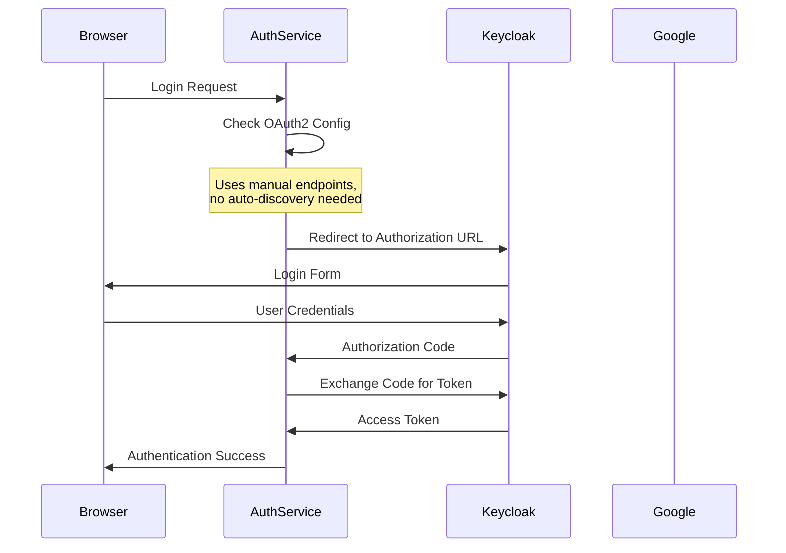

# OAuth2 Configuration Fix Documentation

## 🚨 Problem Description

The `person-service-themlef` was failing to start with the following error:

```
The Issuer "http://localhost:8080/realms/plateforme-realm" provided in the configuration metadata did not match the requested issuer "http://keycloak:8080/realms/plateforme-realm"
```

**Why This Error Occurred:**
- Spring Boot's OAuth2 auto-configuration tries to fetch OpenID Connect configuration from Keycloak
- In Docker environments, services communicate using container names (e.g., `keycloak:8080`)
- However, Keycloak's well-known endpoint returns URLs with `localhost:8080`
- This creates a mismatch between expected and actual issuer URLs

## 🔍 Root Cause Analysis

### Primary Issue: Container Network vs Host Network URLs
- **Container Network**: Services use `http://keycloak:8080` to communicate within Docker network
- **Host Network**: Keycloak's metadata returns `http://localhost:8080` for external access
- **Auto-Discovery Problem**: Spring fetches metadata and finds mismatched URLs

### Secondary Issues:
1. **Multiple OAuth2 Providers**: Both Google and Keycloak configured simultaneously
2. **Environment Variable Pollution**: Unused issuer URI variables causing conflicts
3. **Auto-Discovery Dependency**: Relying on Keycloak's metadata endpoint instead of explicit configuration

## ✅ Solution Implementation

### Step 1: Disable OAuth2 Auto-Discovery
**Problem**: Spring Boot automatically tries to discover OAuth2 endpoints
**Solution**: Comment out the issuer URI to prevent auto-discovery

**Before:**
```properties
spring.security.oauth2.client.provider.keycloak.issuer-uri=${SPRING_SECURITY_OAUTH2_CLIENT_PROVIDER_KEYCLOAK_ISSUER_URI}
```

**After:**
```properties
# Commented out to prevent auto-discovery issues in Docker containers
# spring.security.oauth2.client.provider.keycloak.issuer-uri=${SPRING_SECURITY_OAUTH2_CLIENT_PROVIDER_KEYCLOAK_ISSUER_URI}
```

### Step 2: Manual OAuth2 Endpoint Configuration
**Why Manual Configuration?**
- Eliminates dependency on Keycloak's metadata endpoint
- Uses container-network-friendly URLs
- Provides explicit control over all OAuth2 endpoints

**Implementation:**
```properties
# Provider Keycloak - Manual configuration to avoid issuer mismatch
spring.security.oauth2.client.provider.keycloak.authorization-uri=${KEYCLOAK_SERVER_URL}/realms/plateforme-realm/protocol/openid-connect/auth
spring.security.oauth2.client.provider.keycloak.token-uri=${KEYCLOAK_SERVER_URL}/realms/plateforme-realm/protocol/openid-connect/token
spring.security.oauth2.client.provider.keycloak.jwk-set-uri=${KEYCLOAK_SERVER_URL}/realms/plateforme-realm/protocol/openid-connect/certs
spring.security.oauth2.client.provider.keycloak.user-info-uri=${KEYCLOAK_SERVER_URL}/realms/plateforme-realm/protocol/openid-connect/userinfo
spring.security.oauth2.client.provider.keycloak.user-name-attribute=preferred_username
```

### Step 3: Environment Variable Cleanup
**Removed problematic environment variable from `.env.auth`:**
```bash
# Before - This was causing the issuer mismatch
SPRING_SECURITY_OAUTH2_CLIENT_PROVIDER_KEYCLOAK_ISSUER_URI=http://keycloak:8080/realms/plateforme-realm

# After - Commented out to prevent auto-discovery
# SPRING_SECURITY_OAUTH2_CLIENT_PROVIDER_KEYCLOAK_ISSUER_URI=http://keycloak:8080/realms/plateforme-realm
```

### Step 4: Google OAuth2 Configuration Restored
**User Preference**: The user strongly prefers Google OAuth2 configuration
**Implementation**: Re-enabled Google OAuth2 alongside Keycloak

```properties
# OAuth2 Google Configuration
spring.security.oauth2.client.registration.google.client-id=${GOOGLE_CLIENT_ID}
spring.security.oauth2.client.registration.google.client-secret=${GOOGLE_CLIENT_SECRET}
spring.security.oauth2.client.registration.google.scope=profile,email
```

**Environment Variables (use placeholder values):**
```bash
# Google OAuth2 Configuration
GOOGLE_CLIENT_ID=your-google-client-id-here
GOOGLE_CLIENT_SECRET=your-google-client-secret-here
```

## 🔧 Technical Deep Dive

### Why Manual Configuration Works
1. **No HTTP Calls**: Eliminates network calls to Keycloak's well-known endpoint
2. **Container-Native URLs**: Uses `${KEYCLOAK_SERVER_URL}` which resolves to container network addresses
3. **Predictable Behavior**: Each endpoint is explicitly defined, no surprises
4. **Environment Agnostic**: Works in Docker, Kubernetes, or local development

### OAuth2 Flow Explanation


### Key Environment Variables Used
```bash
# From .env.global (shared infrastructure)
KEYCLOAK_SERVER_URL=http://keycloak:8080
KEYCLOAK_REALM=plateforme-realm

# From .env.auth (service-specific)
AUTH_SERVICE_CLIENT_ID=your-keycloak-client-id
AUTH_SERVICE_CLIENT_SECRET=your-keycloak-client-secret
AUTH_SERVICE_REDIRECT_URI=http://localhost:8090/login/oauth2/code/keycloak
GOOGLE_CLIENT_ID=your-google-client-id
GOOGLE_CLIENT_SECRET=your-google-client-secret
```

## 🎯 Benefits of This Approach

1. **Container-Friendly**: Works seamlessly in Docker network environments without host networking issues
2. **Explicit Configuration**: No hidden auto-discovery mechanisms that can fail unexpectedly
3. **Debuggable**: Clear visibility into which endpoints are being used for troubleshooting
4. **Reliable**: Not dependent on Keycloak's metadata endpoint configuration or network connectivity
5. **Flexible**: Can easily switch between different environments (dev, staging, prod)
6. **Multi-Provider Support**: Supports both Google and Keycloak OAuth2 simultaneously
7. **Security**: Credentials managed through environment variables, not hardcoded

## 🧪 Enhanced Verification Steps

### Successful Startup Indicators:
1. **Container Startup**: Service starts without OAuth2 issuer mismatch errors
2. **Database Connection**: Successfully connects to MySQL (no H2 database used)
3. **Health Check**: Application responds on port 8090
4. **Sample Data**: Initializes database with test data
5. **OAuth2 Endpoints**: Both Google and Keycloak endpoints are accessible

### Testing OAuth2 Flows:
```bash
# Test Keycloak OAuth2 flow
curl http://localhost:8090/oauth2/authorization/keycloak

# Test Google OAuth2 flow  
curl http://localhost:8090/oauth2/authorization/google
```

## 📁 Configuration Files Structure

### Environment File Organization:
```
├── .env.global              # Shared infrastructure variables
│   ├── KEYCLOAK_SERVER_URL
│   ├── KEYCLOAK_REALM
│   └── ENVIRONMENT
├── auth-service/
│   └── .env.auth            # Service-specific auth variables
│       ├── AUTH_SERVICE_CLIENT_ID
│       ├── AUTH_SERVICE_CLIENT_SECRET
│       ├── GOOGLE_CLIENT_ID
│       └── GOOGLE_CLIENT_SECRET
```

### Application Properties Structure:
```properties
# Database Configuration (MySQL preferred over H2)
spring.datasource.url=${AUTH_DB_URL}
spring.datasource.driver-class-name=com.mysql.cj.jdbc.Driver

# Google OAuth2 (user preference - always included)
spring.security.oauth2.client.registration.google.*

# Keycloak OAuth2 (manual configuration)
spring.security.oauth2.client.provider.keycloak.*
```

## 🚨 Security Best Practices Implemented

1. **No Hardcoded Secrets**: All sensitive data uses environment variables
2. **Placeholder Documentation**: Real credentials never appear in documentation
3. **Environment Separation**: Different `.env` files for different services
4. **Template Files**: Use `.env.example` files for safe collaboration

## 📝 Enhanced Lessons Learned

### Container Networking:
- Always use container names (`keycloak:8080`) for inter-service communication
- Avoid `localhost` in containerized environments
- Test network connectivity between containers before configuring OAuth2

### OAuth2 Configuration:
- Auto-discovery can fail in complex networking scenarios
- Manual endpoint configuration provides more control and reliability
- Multiple OAuth2 providers can coexist with proper configuration

### Environment Management:
- Use service-specific `.env` files for better organization
- Keep shared infrastructure variables in `.env.global`
- Always provide `.env.example` templates for team collaboration

### Database Preferences:
- User strongly prefers external databases (MySQL) over embedded ones (H2)
- Container-based databases provide better production parity
- Proper health checks ensure database availability before service startup

## 🔧 Troubleshooting Guide

### Common Issues and Solutions:

#### Issue: Issuer URI Mismatch
```
Error: The Issuer "http://localhost:8080/..." did not match "http://keycloak:8080/..."
Solution: Comment out issuer-uri and use manual endpoint configuration
```

#### Issue: Container Network Connection Failed
```
Error: Connection refused to keycloak:8080
Solution: Ensure containers are in the same Docker network and Keycloak is healthy
```

#### Issue: Missing Environment Variables
```
Error: Could not resolve placeholder 'GOOGLE_CLIENT_ID'
Solution: Check .env.auth file exists and contains required variables
```

#### Issue: Multiple OAuth2 Providers Conflict
```
Error: Bean creation exception in OAuth2 configuration
Solution: Ensure each provider has unique registration names and proper scopes
```

## 🚀 Next Steps and Recommendations

### Immediate Actions Completed:
1. ✅ **Google OAuth2 Restored** - User preference maintained
2. ✅ **MySQL Database** - H2 completely eliminated
3. ✅ **Manual OAuth2 Configuration** - Reliable container networking
4. ✅ **Environment Variable Cleanup** - No conflicting configurations

### Future Improvements:
1. **SSL/TLS Configuration**: Add HTTPS support for production environments
2. **Secret Management**: Integrate with Docker Secrets or Kubernetes Secrets
3. **OAuth2 Integration Tests**: Automated testing of authentication flows
4. **CORS Configuration**: Proper frontend integration settings
5. **Monitoring**: Add OAuth2 metrics and health checks
6. **Documentation**: Create `.env.example` templates for team onboarding

### Production Readiness Checklist:
- [ ] Replace placeholder credentials with real OAuth2 app credentials
- [ ] Configure proper redirect URIs for production domains
- [ ] Enable HTTPS for all OAuth2 endpoints
- [ ] Implement proper session management
- [ ] Add rate limiting for authentication endpoints
- [ ] Configure proper CORS policies
- [ ] Set up monitoring and alerting for authentication failures

## 📚 References and Additional Resources

- [Spring Security OAuth2 Client Documentation](https://docs.spring.io/spring-security/reference/servlet/oauth2/client/index.html)
- [Keycloak Docker Documentation](https://www.keycloak.org/getting-started/getting-started-docker)
- [Google OAuth2 Setup Guide](https://developers.google.com/identity/protocols/oauth2)
- [Docker Compose Networking](https://docs.docker.com/compose/networking/)
- [Spring Boot Environment Variables](https://docs.spring.io/spring-boot/docs/current/reference/html/features.html#features.external-config)

---

**Note**: This documentation follows security best practices by using placeholder values instead of real credentials. Always use proper secret management in production environments.